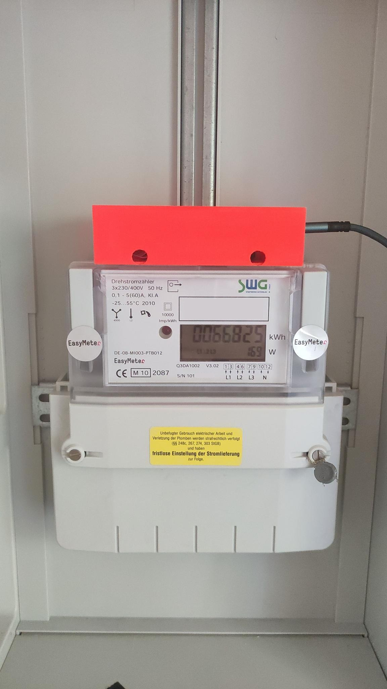
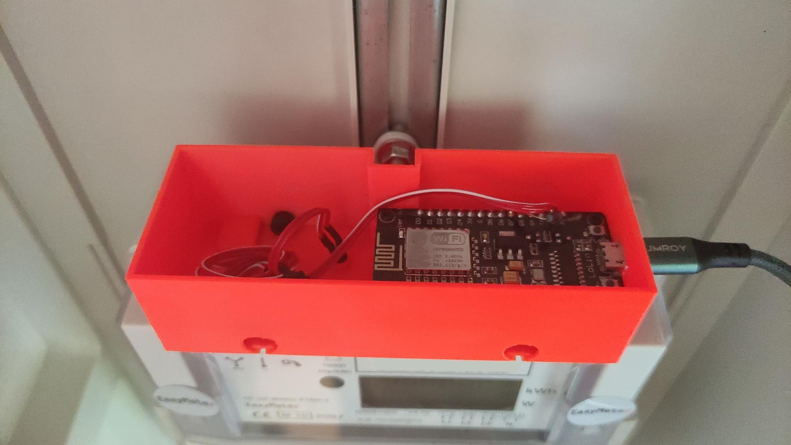
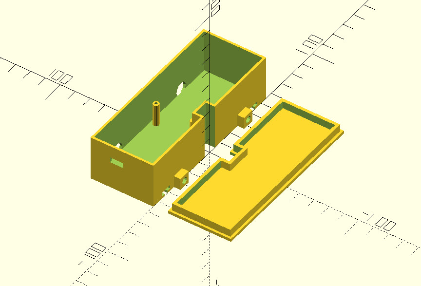

This is an OpenSCAD project for a casing for the **Easymeter Q3DA1002** top 
infrared diagnostic port. It houses a Lolin NodeMCU esp8266
based microcontroller. Using the Tasmota Firmware lets you send out 
the smartmeter readings via MQTT.

