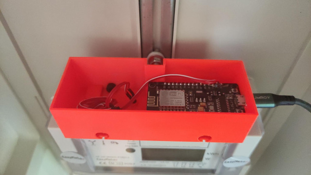

This is an OpenSCAD project for a casing for the **Easymeter Q3DA1002** top 
infrared diagnostic port. It houses a Lolin NodeMCU esp8266
based microcontroller. Using the Tasmota Firmware lets you send out 
the smartmeter readings via MQTT.

Top mount the topcase on the Easymeter you'll need 2xM4x10mm.

The infrared window is designed for an 3mm SFH 309FA photo transistor. Additionally
you would need a 100KΩ resistor and a NodeMCU.

